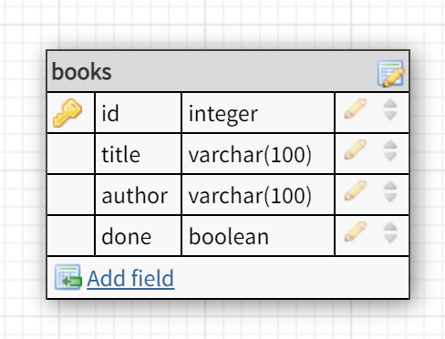

# BookList

## About
This app allows users to create a list of books they want to read. Books can be added to the list, marked as completed, or deleted.

## Setup

### Dependencies

- Run `npm install` in project directory. This will install server-related dependencies such as `express`.
- `cd client` and run `npm install`. This will install client dependencies such as `react`.

### Database Prep
- Access the MySQL interface in your terminal.
- Create a new database called books: `create database booklist`
- Add a `.env` file to the project folder of this repository containing the MySQL authentication information for MySQL user. For example:

```bash
  DB_HOST=localhost
  DB_NAME=booklist
  DB_USER=root
  DB_PASS=YOURPASSWORD
```

- Run `npm run migrate` in the project folder of this repository, in a new terminal window. This will create the tables used in this database.

### Development

- Run `npm start` in project directory to start the Express server.
- In another terminal, `cd client` and run `npm start` to start the client. 

## DatabaseSchema



## User flow diagram


## Possible Future Extensions
- New view for books that have been completed
- Rate books
- List books in alphabetical order by title or author
- Search books function

